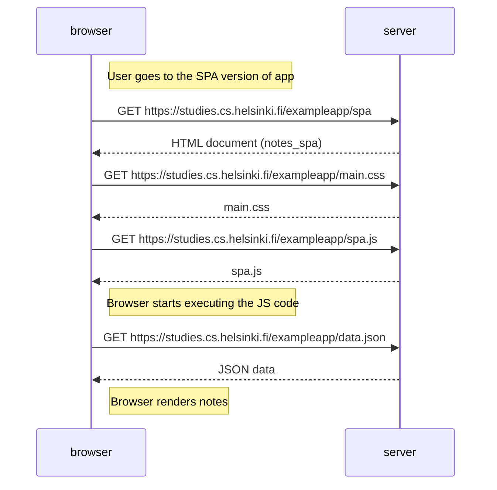

```mermaid
sequenceDiagram
    participant browser
    participant server

    Note right of browser: User goes to the SPA version of app

    browser->>server: GET https://studies.cs.helsinki.fi/exampleapp/spa
    server-->>browser: HTML document (notes_spa)
    browser->>server: GET https://studies.cs.helsinki.fi/exampleapp/main.css
    server-->>browser: main.css
    browser->>server: GET https://studies.cs.helsinki.fi/exampleapp/spa.js
    server-->>browser: spa.js
    Note right of browser: Browser starts executing the JS code
    browser->>server: GET https://studies.cs.helsinki.fi/exampleapp/data.json
    server-->>browser: JSON data
    Note right of browser: Browser renders notes
```