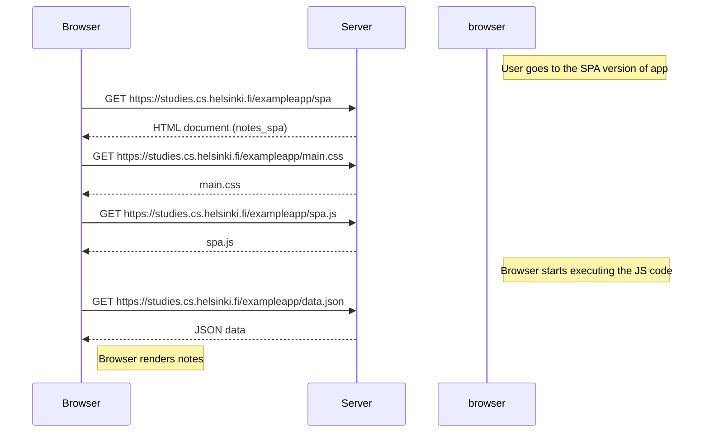

```mermaid
sequenceDiagram
    participant Browser
    participant Server

    Note right of browser: User goes to the SPA version of app

    Browser->>Server: GET https://studies.cs.helsinki.fi/exampleapp/spa
    Server-->>Browser: HTML document (notes_spa)
    Browser->>Server: GET https://studies.cs.helsinki.fi/exampleapp/main.css
    Server-->>Browser: main.css
    Browser->>Server: GET https://studies.cs.helsinki.fi/exampleapp/spa.js
    Server-->>Browser: spa.js
    Note right of browser: Browser starts executing the JS code
    Browser->>Server: GET https://studies.cs.helsinki.fi/exampleapp/data.json
    Server-->>Browser: JSON data
    Note right of Browser: Browser renders notes
```