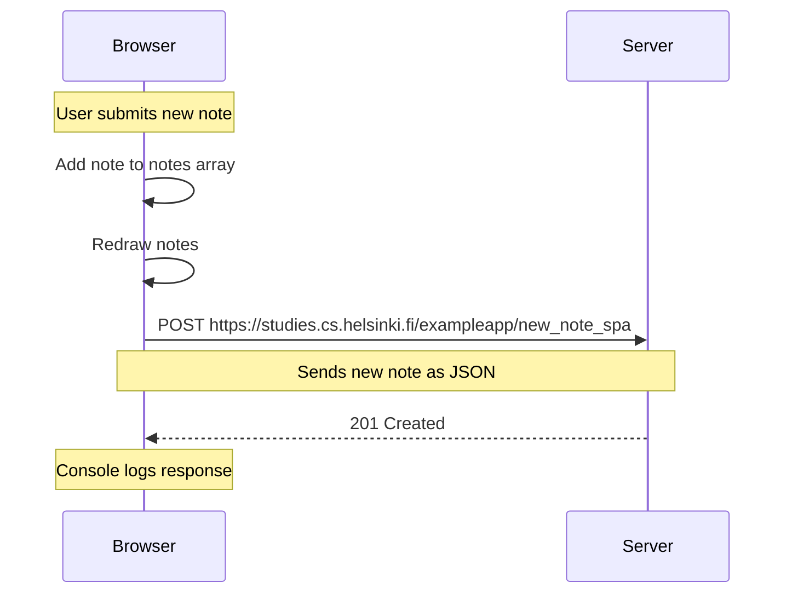

```mermaid
sequenceDiagram
    participant Browser
    participant Server

    Note over Browser: User submits new note
    Browser->>Browser: Add note to notes array
    Browser->>Browser: Redraw notes
    Browser->>Server: POST https://studies.cs.helsinki.fi/exampleapp/new_note_spa
    Note over Browser,Server: Sends new note as JSON
    Server-->>Browser: 201 Created
    Note over Browser: Console logs response
```